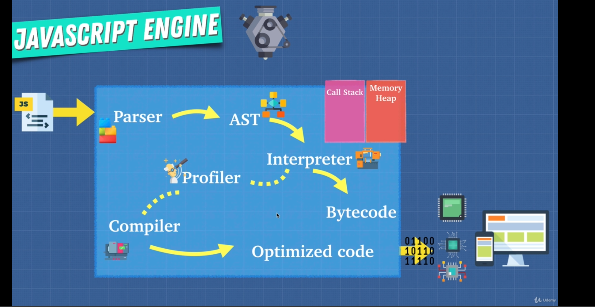

JavaScript is an interpreted language for the most part. That means it goes line by line at runtime to process the execution. There's no any extra step of compiling the code to any other form. There are tools like Hermes that compiles the JavaScript code in build time into machine code so that the code executes faster in runtime. React Native uses Hermes as a JavaScript engine.

But the JavaScript engine like V8 has something called JIT i.e. Just-In-Time compilation which combines the best of the both worlds of interpreter and compiler.

Things that makes JavaScript slow or JavaScript engine avoids optimizations:
- eval()
- delete
- use of arguments keyword inside function
- for...in/for...of loops. Always use raw for loop
- with keyword